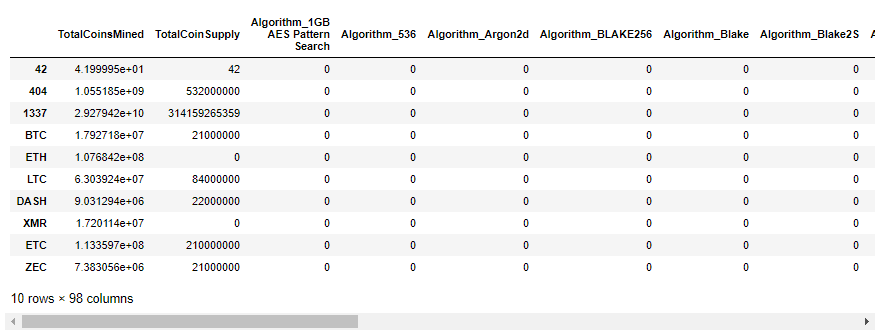
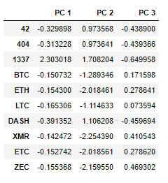
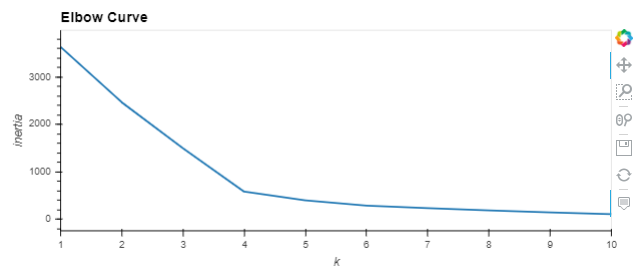
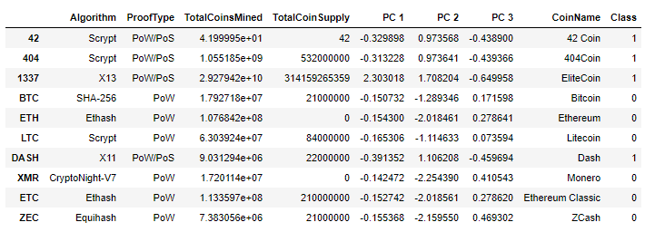
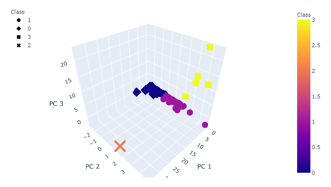
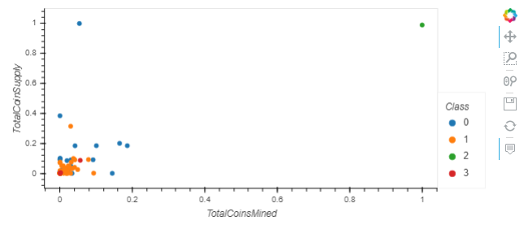

# Cryptocurrencies

The purpose of this project was to create a report that includes what cryptocurrencies are on the trading market and use unsupervised machine learning to determine how they could be grouped to create a classification system for a new cryptocurrency investment.  The following steps were used to complete the project:
1. Preprocessing the Data for PCA
2. Reducing Data Dimensions Using PCA
3. Clustering Cryptocurrencies Using K-means
4. Visualizing Cryptocurrencies Results

### Resources
Data: crypto_data.csv </br>
Software: Python 3.7.9, Pandas 1.1.3, Plotly 4.14.3, hvplot 0.7.0, SciKit-Learn 0.23.2 </br>

### Summary
The project was broken down into the four steps mentioned above.  The first step was to preprocess the data for PCA.  This included looking at the original dataset, determining which data needed to be included in the analysis, removing rows with null values, using get_dummies to create numerical values for string data and using StandardScaler() to scale the data.  The following code was used after importing all dependencies.

```py
  # Load the crypto_data.csv dataset.
  crypto_df = pd.read_csv("crypto_data.csv", index_col=0)
  
  # Keep all the cryptocurrencies that are being traded.
  crypto_df = crypto_df[crypto_df["IsTrading"] == True]
  
  # Keep all the cryptocurrencies that have a working algorithm.
  crypto_df = crypto_df[crypto_df["Algorithm"].notna()]
  
  # Remove the "IsTrading" column. 
  crypto_df.drop(columns=["IsTrading"], inplace=True)
  
  # Remove rows that have at least 1 null value.
  crypto_df = crypto_df.dropna()
  
  # Keep the rows where coins are mined.
  crypto_df = crypto_df[crypto_df["TotalCoinsMined"] > 0]
  
  # Create a new DataFrame that holds only the cryptocurrencies names.
  CoinName_df = pd.DataFrame(crypto_df["CoinName"])
  
  # Drop the 'CoinName' column since it's not going to be used on the clustering algorithm.
  crypto_df.drop(columns=["CoinName"], inplace=True)
  
  # Use get_dummies() to create variables for text features.
  x = pd.get_dummies(crypto_df, columns=['Algorithm', 'ProofType'])
  
  # Standardize the data with StandardScaler().
  x_scaled = StandardScaler().fit_transform(x.values)
```
Below is what the first few columns of the preprocessed dataframe looked like before scaling.  There are a total of 98 columns.



The next step in the project was to reduce the data dimensions using PCA.  After preprocessing the data, there were 98 different columns in the dataset that could have possibly each been their own dimension.  However, using PCA, the data was reduced to only 3 principal components to represent the data as a smaller set of variables in order to more easily observe any clusters.  The following code was used to reduce the dimensions.

```py# Initialize PCA Model
  pca = PCA(n_components=3)
  x_pca = pca.fit_transform(x_scaled)
  
  # Create a DataFrame with the three principal components.
  pcs_df = pd.DataFrame(data=x_pca, columns=["PC 1", "PC 2", "PC 3"], index=crypto_df.index)
```

Below is what the dataframe looks like after reducing the dimensions.



The third step in the project was to cluster the cryptocurrencies using the K-means algorithm.  This was completed by first creating an elbow curve and determining the ideal number of clusters (which turned out to be 4 for this model), and then initializing the K-means model, fitting the model to the data and using the model to predicting the clusters.  The results of the model were then added to a new dataframe along with the reduced dimensions and some of the original data.  The following code was used to cluster the data.

```py
  # Create an elbow curve to find the best value for K.
  inertia = []
  k = list(range(1, 11))

  # Calculate the inertia for the range of K values
  for i in k:
      km = KMeans(n_clusters=i, random_state=0)
      km.fit(pcs_df)
      inertia.append(km.inertia_)

  # Create the elbow curve
  elbow_data = {"k": k, "inertia": inertia}
  df_elbow = pd.DataFrame(elbow_data)
  df_elbow.hvplot.line(x="k", y="inertia", xticks=k, title="Elbow Curve")
```


```py
# Initialize the K-Means model.
model = KMeans(n_clusters=4, random_state=0)

# Fit the model
model.fit(pcs_df)

# Predict clusters
predictions = model.predict(pcs_df)
predictions

# Create a new DataFrame including predicted clusters and cryptocurrencies features.
# Concatentate the crypto_df and pcs_df DataFrames on the same columns.
clustered_df = pd.concat([crypto_df, pcs_df], axis=1)

#  Add a new column, "CoinName" to the clustered_df DataFrame that holds the names of the cryptocurrencies. 
clustered_df = pd.concat([clustered_df, CoinName_df], axis=1)

#  Add a new column, "Class" to the clustered_df DataFrame that holds the predictions.
clustered_df["Class"] = model.labels_

# Print the shape of the clustered_df
print(clustered_df.shape)
clustered_df.head(10)
```



The final step of the project was to create visualizations of the cryptocurrencies results.  First the PCA data was plotted on a 3D scatter plot as shown below.



Next, the data from the TotalCoinSupply and TotalCoinsMined columns was scaled using the MinMaxScaler() and hvplot was used to create a scatter plot of the total coins mined versus the total coin supply for all of the tradable cryptocurrencies, identified by Class (from the K-means clusters).  The resulting chart is below.


